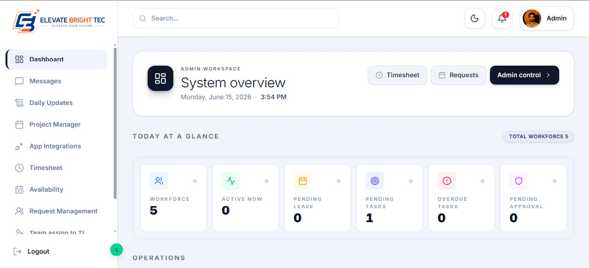
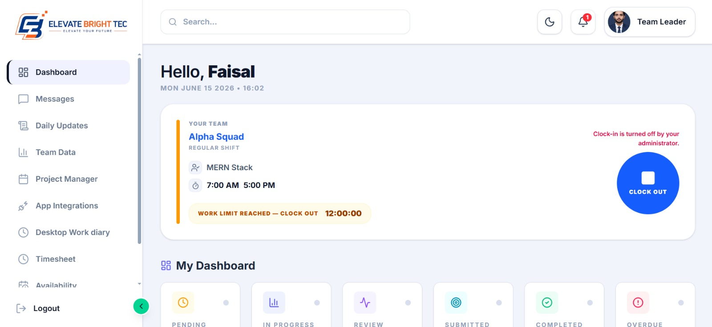
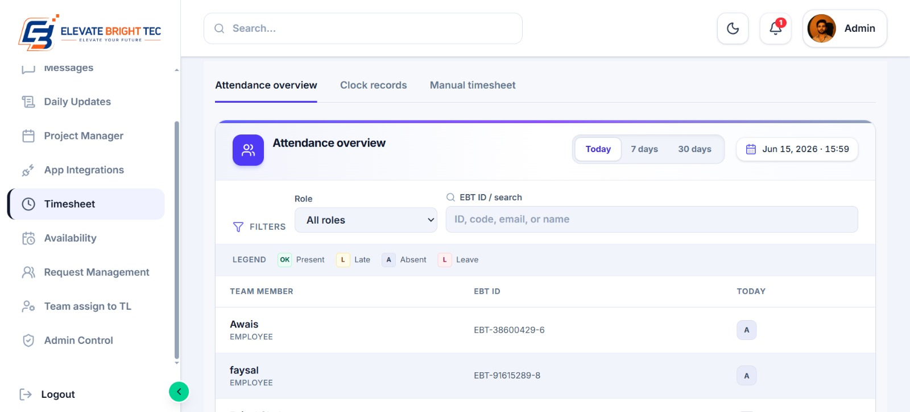
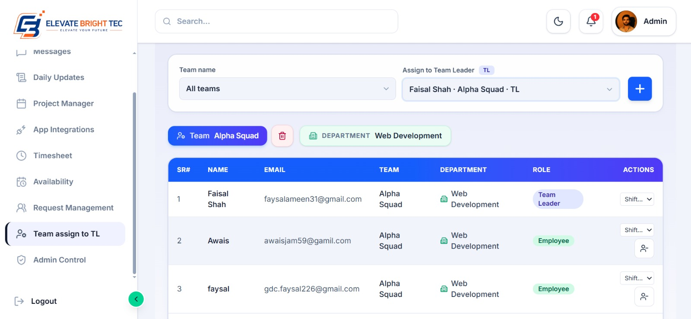
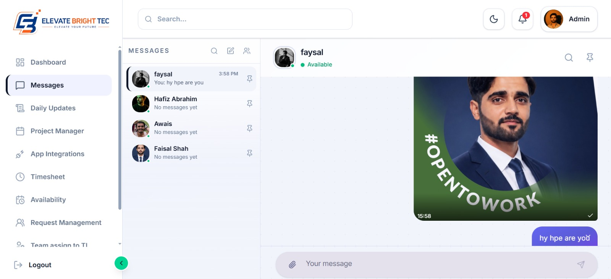

# 🚀 Elevate Bright Tec CRM

<p align="center">
  Elevate Bright Tec CRM Banner
</p>

<p align="center">
  Modern CRM & Workforce Management Platform built with Next.js, TypeScript, Express.js, and PostgreSQL.
</p>

<p align="center">
  Employee Management • Attendance Tracking • Timesheets • Tasks • Messaging • Analytics
</p>

---

## 📖 Overview

Elevate Bright Tec CRM is a comprehensive workforce and customer relationship management platform designed to streamline employee operations, attendance tracking, task management, communication, and business workflows.

The platform provides administrators, managers, and employees with an intuitive dashboard to manage daily operations efficiently while maintaining real-time visibility into organizational activities.

---

## 📸 Screenshots

### Dashboard



### Team Leader



### Attendance & Timesheets



### Team Management



### Messaging System



---

## ✨ Key Features

* 🔐 Secure Authentication & Authorization
* 👥 Employee Management
* ⏰ Attendance Tracking
* 📋 Timesheet Management
* ✅ Task Assignment & Monitoring
* 💬 Real-Time Messaging
* 📊 Analytics Dashboard
* 🔔 Notifications System
* 📱 Responsive Design
* 🌐 REST API Integration

---

## 🛠 Tech Stack

### Frontend

* Next.js 15
* React.js
* TypeScript
* Tailwind CSS
* Axios
* Zustand / Context API

### Backend

* Express.js
* Node.js
* PostgreSQL
* Prisma ORM
* JWT Authentication

### Deployment

* Vercel
* Render
* Supabase

---

## 📂 Project Structure

```text
src/
├── app/
├── components/
├── lib/
│   ├── api/
│   ├── store/
│   └── utils/
├── services/
├── views/
├── hooks/
└── types/
```

## ⚙️ Environment Variables

Create a `.env.local` file:

```env
NEXT_PUBLIC_API_URL=your_api_url
```

---

## 🚀 Getting Started

Clone the repository:

```bash
git clone <repository-url>
```

Install dependencies:

```bash
npm install
```

Start development server:

```bash
npm run dev
```

Open:

```text
http://localhost:3000
```

---

## 🔗 API Integration

The application communicates with the Express.js backend through a centralized API service layer.

### Features

* Axios Configuration
* JWT Authentication
* Cookie-based Session Management
* Role-based Authorization
* Error Handling
* Request Interceptors

---

## 📈 Future Enhancements

* Real-Time Notifications
* Advanced Reporting
* Mobile Application
* Payroll Integration
* HR Management Module
* Performance Analytics

---

## 👨‍💻 Developer

**Faisal Ameen**

Software Engineer | Full Stack Developer

Portfolio:
https://faisalameenportfolio.vercel.app/

LinkedIn:
https://www.linkedin.com/in/faisal-ameen07/

---

## 🏢 Company

Elevate Bright Tec

Building innovative digital solutions for modern businesses.
